# Create, Open and run a new Ktor project

from: https://ktor.io/docs/server-create-a-new-project.html

- 이 튜토리얼에서, 첫번재 Ktor 서버 프로젝트를 생성하고 실행할 것이다. 
- 일단 이 프로젝트를 실행하고 나면 Ktor을 이용하여 일련의 태스크를 수행할 수 있게 된다. 


- 튜토리얼의 첫번째로 서버 어플리케이션을 Ktor을 이용하여 개발할 것이다. 
- 각 튜토리얼은 독립적으로 수행할 수 있다. 그러나 강력히 추천하건데 처음부터 순서대로 따라오길 바란다. 


- 1. Create, Oepn and run a new Ktor project
- 2. Create Http APIs
- 3. Create a static website.
- 4. Create an interactive website.
- 5. Create a WebSocket chat.

## Create a new Ktor Project

- 일단 가장 빠르게 Ktor 프로젝트를 생성하는 방법은 web-based Ktor project generator를 이용하는 것이다. 
- [Ktor Project Generator](https://start.ktor.io/?_ga=2.174591845.690621735.1708524236-588734844.1708524236&_gl=1*1nqx6gh*_ga*NTg4NzM0ODQ0LjE3MDg1MjQyMzY.*_ga_9J976DJZ68*MTcwODU2MjU0NS4yLjAuMTcwODU2MjU1My41Mi4wLjA.#/settings)

- 대안으로 IntelliJ IDEA Ulitmate 를 설치하고, https://ktor.io/docs/server-create-a-new-project.html#create_project_with_intellij 에서 ktor을 직접 생성하는 방법이 있다. 

### Use the Ktor project generator

- 다음 스텝을 따라서 Ktor 프로젝트를 생성할 수 있다. 
- https://start.ktor.io/?_ga=2.73330516.690621735.1708524236-588734844.1708524236&_gl=1*1iofbub*_ga*NTg4NzM0ODQ0LjE3MDg1MjQyMzY.*_ga_9J976DJZ68*MTcwODUyNDIzNS4xLjEuMTcwODUyNTY5OC4wLjAuMA..
- 1. 위 주소에서 ktor 프로젝트 생성기를 연다. 
- 2. 프로젝트 이름에는 ktor-sample-app 라고 이름을 작성한다.
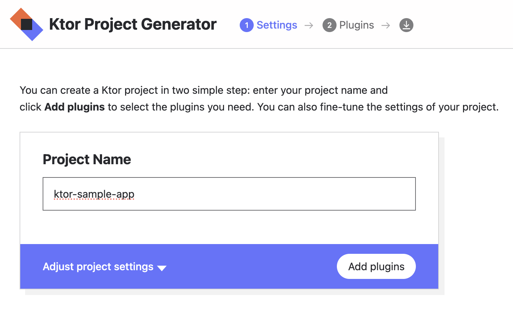 
- 3. "Adjust project settings" 를 클릭하여 세팅 메뉴를 확장한다. 
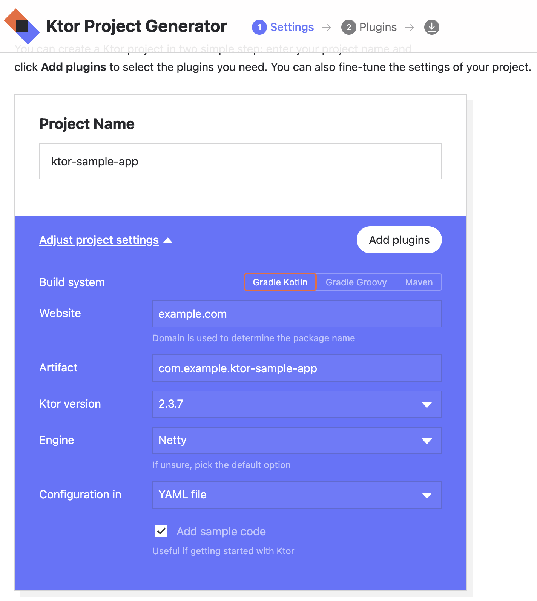
  - Build System: 
    - 빌드 시스템을 선택한다. 이것은 Gradle kotlin과 Groovy DSL, Maven 등을 선택할 수 있다. 
  - Website
    - 패키지 이름을 생성할 특정 도메인을 작성한다. 
  - Artifact
    - 이 필드는 생성된 아티팩트 이름을 나열한다. 
  - Ktor version
    - Ktor 버젼을 선택한다. 
  - Engine
    - 서버를 수행할 엔진을 선택한다. 
  - Configuration in
    - 코드에 있는 특정 서버 파라미터를 선택한다. 
  - Add sample code
    - 이 옵션은 add sample code 로 그대로 두어 다음 페이지에서 플러그인을 추가하도록 놔둔다. 
  - 이 튜토리얼에서는 그대로 두자. 
- 4. Add Plugins 를 클릭하고 다음 섹션으로 넘어간다. 
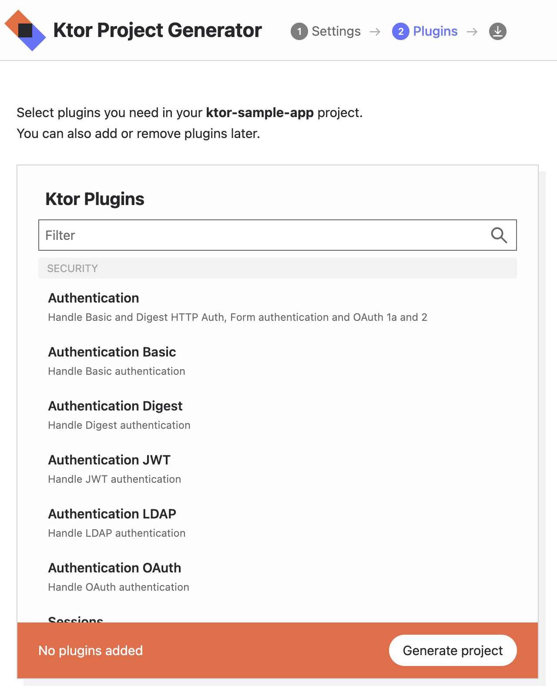
  - 여기에서는 플러그인을 선택할 수 이다. 
  - 이는 공통적인 Ktor 어플리케이션을 위한 기능을 선택한다. 
  - 예를 인증, 직렬화, 내용 인코딩, 압축, 쿠키 지원 등을 선택할 수 있다. 
- 5. General project 를 클릭하여 Ktor 프로젝트를 생성하고 다운로드 한다. 

- 모두 다운받으면 프로젝트 패키지를 압축을 해제하자. 

## Open, explore and run your Ktor project in IntelliJ IDEA

### 프로젝트 오픈하기 

- IntelliJ 를 사용한다면, 프로젝트 디렉토리로 이동하여 다음 커맨드를 실행하면 된다. 

```sh
idea .
```

- 그렇지 않으면 IntelliJ IDEA를 열고 수동으로 File > Open 을 클릭하고 프로젝트 폴더를 선택하여 열어주자. 

### 프로젝트 탐색하기 

- 다음과 같이 프로젝트 탐색창을 확인하자. 

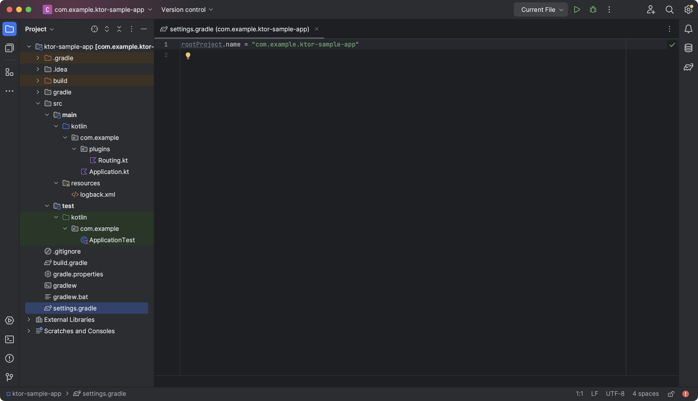

- 프로젝트 레이아웃을 확인할 수 있다. 
- Project 뷰와 settings-gradle.kts 파일을 확인할 수 있다. 

- src/main/kotlin 패키지 하위에 어플리케이션 코드가 존재함을 알 수 있다. 
- 기본 패키지는 com.example 로 불리며, plugins 패키지를 포함하고 있다. 
- 아래 2개의 파일은 이 패키지하위에 포함되어 있다. 
- Application.kt 파일과 Routing.kt 파일이 기본 생성된 파일이다. 

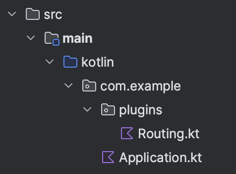

- 프로젝트의 이름은 settings-gradle.kts 에 설정되어 있다. 

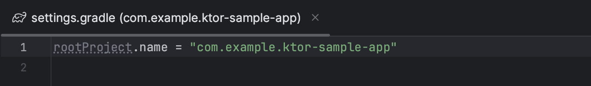

- 설정 파일과 컨테츠 파일들은 src/amin/resources 폴더에 포함된다. 

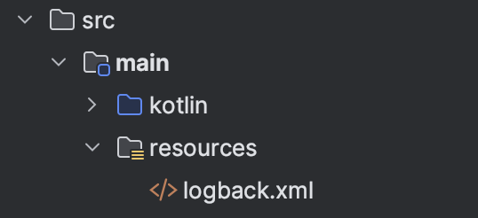

- 스켈레톤 테스트는 src/test/kotlin 디렉토리에 생성된다. 

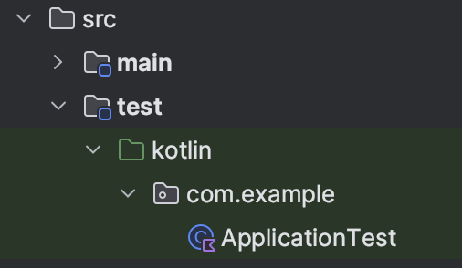

### 프로젝트 실행하기

- Idea를 통해서 프로젝트를 실행하기 우해서 다음과 같이수행하자. 

1. Gradle tool window 를 열고 (오른쪽에 있는) Gradle icon을 클릭하다. 
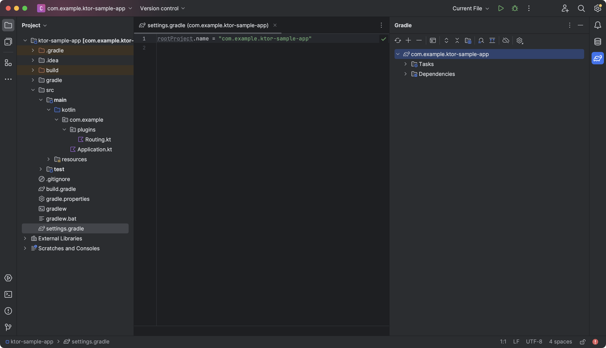
2. Tasks/application 으로 이동하고 run 태스크를 더블클릭한다. 
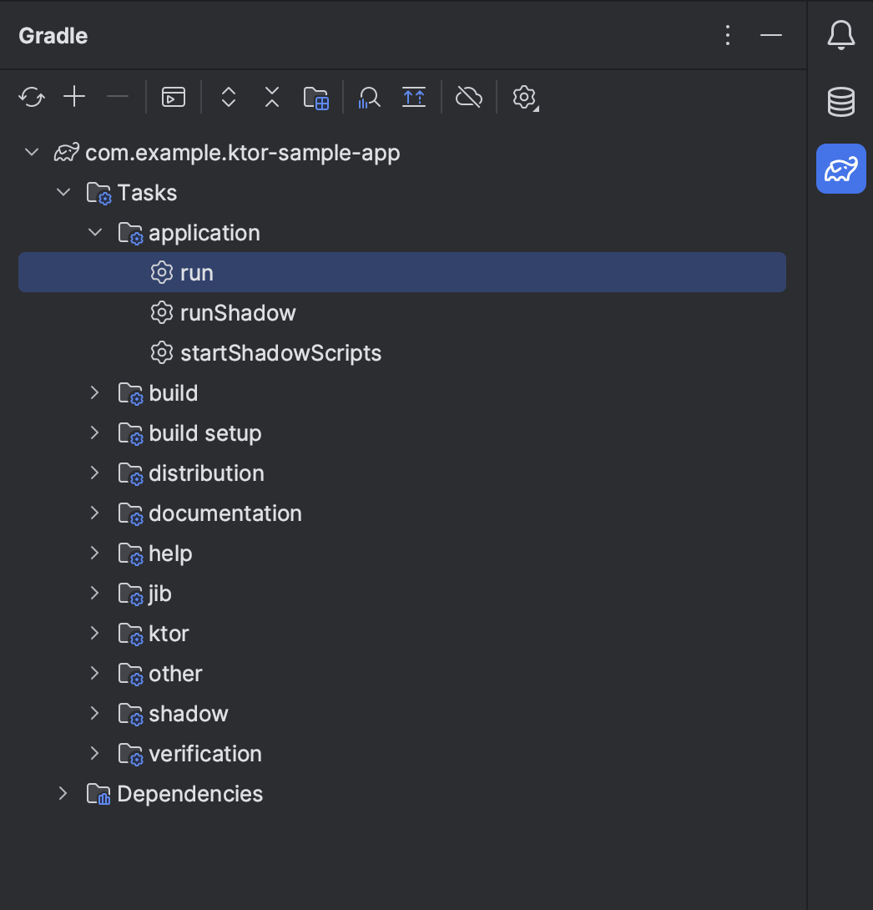
3. Ktor 어플리케이션은 IDEA 하단에 있는 Run tool window 에서 결과를 확인할 수 있다. 
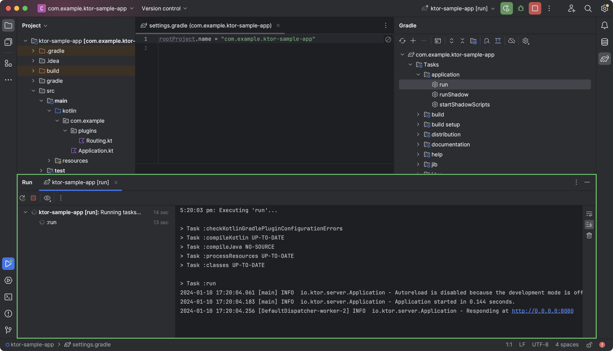
- Run tool window에서 이제 커맨드라인으로 메시지를 확인할 수 있다. 
4. 프로젝트가 수행하는지 확인하기 위해서 브라우저를 열고 (http://0.0.0.0:8080) 을 입력하자. 
- 그러면 "Hello World!" 가 브라우저에 노출된다. 
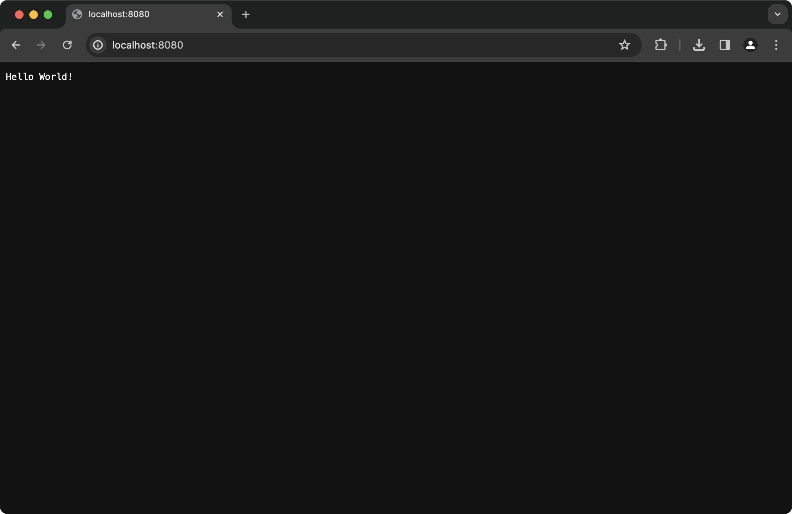

## Additional Tasks To Attempt

- 다음은 우리가 해볼 내용들이다. 
  - 기본 port 변경하기
  - YAML 을 통해서 port 변경하기
  - HTTP 엔드포인트 추가하기
  - 정적 컨텐츠 설정하기
  - 통합테스트 작성하기
  - 에러 핸들러 추가하기
- 이 태스크들은 서로 직접 연관이 없다. 약간의 복잡도 정도 올리는 작업이다. 
- 순서대로 따라하면 쉽게 적용할 수 있다. 

### 기본 포트 변경하기 

- Project 에서 src/main/kotlin 폴더를 따라가자. 이 폴더는 이미 앞 단계에서 생성된 폴더이다. 
- 1. Application.kt 파일을 열고 다음과 같은 코드부분을 확인하자. 
```kt
fun main() {
    embeddedServer(
        Netty,
        port = 8080, // This is the port on which Ktor is listening
        host = "0.0.0.0",
        module = Application::module
    ).start(wait = true)
}

fun Application.module() {
    configureRouting()
}
```
- 2. embeddedServer() 함수에서 포트 파라미터를 다른 포트로 변경한다. 여기서 9292로 바꿔보자. 
```kt
fun main() {
    embeddedServer(
        Netty,
        port = 9292,
        host = "0.0.0.0",
        module = Application::module
    ).start(wait = true)
}
```
- 3. 변경하고 나면 다시 어플리케이션을 실행하자. 
- 4. 그리고 다시 변경된 포트를 검증하기 위해서 (http://0.0.0.0:9292) 를 통해서 다음과 같이 확인하자. 
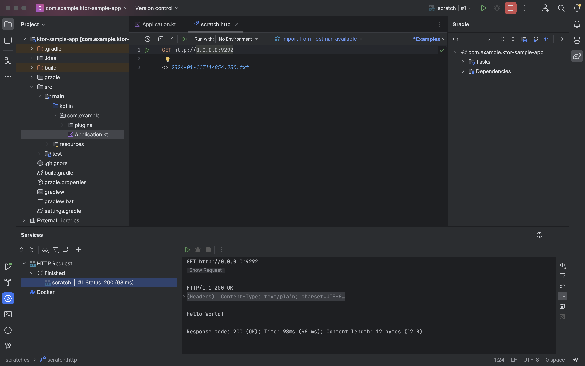

### YAML 을 통해서 포트 변경하기 

- Ktor 프로젝트를 생성할때 설정 파일을 지정할 수 있는데 YAML 혹은 HOCON 파일 등이 있다. 

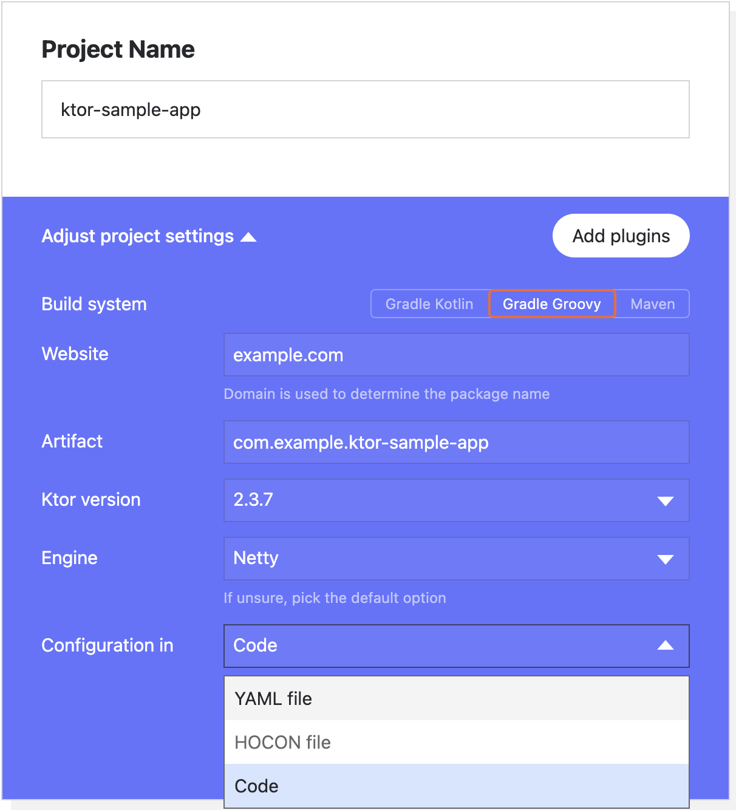

- 만약 이 설정 파일을 선택한경우라면 Application.kt 내부의 코드는 외부 설정 파일에 포함이 된다. 

```kt
fun main(args: Array<String>): Unit =
    io.ktor.server.netty.EngineMain.main(args)

@Suppress("unused")
fun Application.module() {
    configureRouting()
}
```

- 이 설정 파일은 src/main/resources 에 저장된다. 
- 만약 YAML 을 선택했다면 application.yaml 파일을 다음과 같이 작성하자. 

```kt
ktor:
  application:
    modules:
      - com.example.ApplicationKt.module
  deployment:
    port: 8080
```

- 만약 HOCON 을 선택했다면 application.conf 파일을 다음과 같이 작성하자. 

```kt
ktor {
    deployment {
        port = 8080
        port = ${?PORT}
    }
    application {
        modules = [ com.example.ApplicationKt.module ]
    }
}
```

- 이 케이스에서포트 번호 이외에 다른것을 바꿀 필요는 없다.  
- YAML 혹은 HOCON 파일의 값을 변경하고 애플리케이션을 다시 시작하자. 
- 위의 기본 포트와 동일한 방법으로 변경 사항을 확인할 수 있다. 

### HTTP 엔드포인트를 새로 추가하기

- 다음으로 새로운 HTTP 엔드포인트를 생성할 것이다. 그리고 GET요청에 대해서 응답을 해볼 것이다. 
- Project tool window 에서 src/main/kotlin/com/example 로 이동하고 다음을 따른다. 
- 1. Application.kt 파일을 열고, configureRouting() 함수를 추가한다. 
- 2. IntelliJ IDEA 에서 configureRouting() 에 커서를 두고 자동완성(⌘Cmd+C)을 클릭한다. 
  - 그렇지 않다면 Routing.kt 파일을 열어서 작업을 수해할 수 있다. 
  - 다음과 같이 코드를 작성하자. 

```kt
fun Application.configureRouting() {
    routing {
        get("/") {
            call.respondText("Hello World!")
        }
    }
}
  ```
- 3. 새로운 엔드포인트를 생성하기 위해서 아래와 같이 5개 라인을 추가하자. 
  - '/test1' URL을 원하는 다른 것으로 바꿔도 된다. 
```kt
fun Application.configureRouting() {
    routing {
        get("/") {
            call.respondText("Hello World!")
        }

        get("/test1") {
            val text = "<h1>Hello From Ktor</h1>"
            val type = ContentType.parse("text/html")
            call.respondText(text, type)
        }
    }
}
```

- 4. ContentType을 만들기 위해서 다음 내용을 import 하자.

```kt
import io.ktor.http.*
```

- 5. 어플리케이션을 다시 실행하자. 
- 6. 새로운 경로를 다음(http://0.0.0.0:9292/test1)  과 같이 열어보자. 포트 번호는 처음에 지정한 포트에 따라 결정된다. 
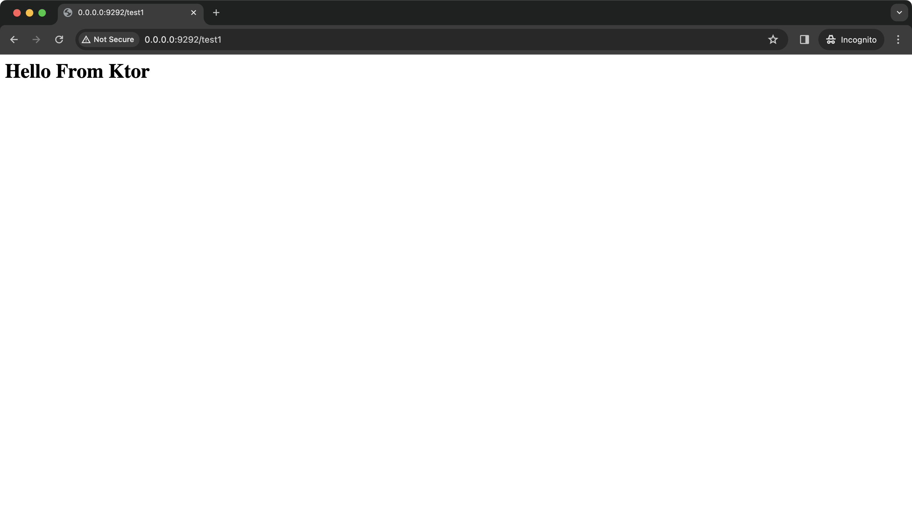

  - 만약 HTTP Request 파일을 생성했다면 다음과 같이 검증할 수 있다. 

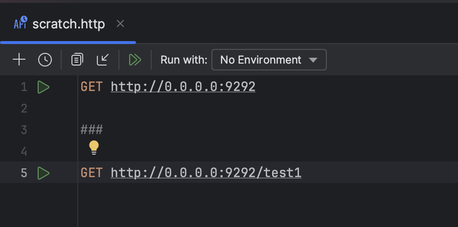

- 3개의 해시 '###' 를 통해서 각 요청을 분리할 수 있다. 

### 정적 컨텐츠 설정하기 

- Project tool window 에서 src/main/kotlin/com/example/plugins 폴더로 이동하고 다음 스텝을 따라가자. 
- 1. Routing.kt 파일을 열고 다시 기본 컨텐츠 내용을 확인하자. 
```kt
fun Application.configureRouting() {
    routing {
        get("/") {
        call.respondText("Hello World!")
    }
}
```

  - 이 태스크는 새 HTTP 엔드포인트를 추가했는지는 중요하지 않다. 
- 2. 다음 라인과 같이 routing 섹션에 추가하자. 
```kt
fun Application.configureRouting() {
    routing {
    // Add the line below
    staticResources("/content", "mycontent")

    get("/") {
        call.respondText("Hello World!")
    }
}
```
  - staticResources() 는 Ktor에게 우리 어플리케이션이 표준 웹사이트 컨텐츠를 제공할 수 있다고 알려준다. 
  - 이것은 HTML, JavaScript 파일등과 같은 것이고, 컨텐츠는 브라우저 내에서 실행될 수 있지만 서버의 관점에서는 정적인 것으로 간주된다. 
  - /content 경로는 이 컨텐츠를 가져오는데 사용해야하는 경로를 지정한다. 
  - mycontent 경로는 폴더의 이름으로 이는 정적 컨텐츠가 있는 위치이다. 
  - Ktor은 resources 디렉토리에서 이 폴더를 찾는다. 
- 3. 다음을 임포트하자. 
```kt
import io.ktor.server.http.content.*
```
- 4. Project tool window에서 src/main/resources 폴더를 오른쪽 클릭한다. 그리고 New | Direct 를 클릭한다. 
- 5. 새로운 디렉토리 이름을 mycontent 로 이름을 지정한다. 
- 6. 새로 생성된 디렉토리에서 오른쪽 클릭을 하고 New|File 을 선택한다. 
- 7. 새로운 파일 이름으로 "sample.html" 을 생성한다. 
- 8. 새롭게 생성된 파일에 다음과 같이 코드를 작성하자. 
```html
<html lang="en">
    <head>
        <meta charset="UTF-8" />
        <title>My sample</title>
    </head>
    <body>
        <h1>This page is built with:</h1>
    <ol>
        <li>Ktor</li>
        <li>Kotlin</li>
        <li>HTML</li>
    </ol>
    </body>
</html>
```
- 9. 다시 어플리케이션을 실행하자. 
- 10. http://0.0.0.0:9292/content/sample.html 을 브라우저로 열어보면 다음과 같이 출력된다. 
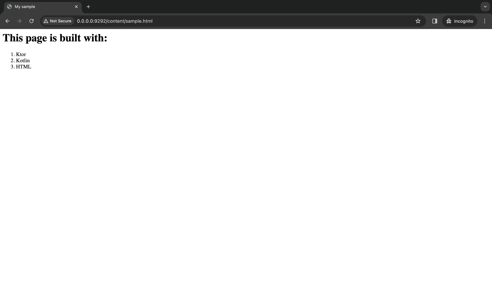

### 통합테스트 작성하기 

- Ktor 는 통합 테스트 생성을 지원한다. 스켈레톤 테스트는 src/test/kotlin 아래 생ㅅ성된다. 
- 기본 설정을 수락했다고 가정하면 클래스는 AppicationTest라고 불리며 com.example 패키지에 저장된다. 
- Project tool window에서 src/test/kotlin 폴더로 가서 다음 스텝을 따라가자. 
- 1. ApplicationTest.kt 파일을 열고 다음 코드를 추가하자. 
```kt
class ApplicationTest {

    @Test
    fun testRoot() = testApplication {
        application {
            module()
        }
        val response = client.get("/")

        assertEquals(HttpStatusCode.OK, response.status)
        assertEquals("Hello World!", response.bodyAsText())
    }
}
```
  - testApplication() 메소드는 Ktor의 새로운 인스턴스를 생성한다. 
  - 이 인스턴스는 test환경 내부에서 수행되고, Netty 와 같은 서버에 대해 테스트한다. 
  - appliation() 메소드를 사용하여 EmbeddedServer() 에서 호출된 것과 동일한 설정을 호출할 수 있다. 
  - 마지막으로 내장된 client 객체를 이용할 수 있고 JUnit 의 assertions를 이용하여 샘플 요청을 보내고, 응답을 확인할 수 있다. 
- 2. 다음 필요한 import이다. 
```kt
import io.ktor.client.request.*
import io.ktor.client.statement.*
import io.ktor.http.*
import io.ktor.server.testing.*
import org.junit.Assert.assertEquals
import org.junit.Test
```

- test는 IntelliJ IDEA에서 테스트를 수행하기 위한 표준 방법중 하나로 실행할 수 있다. 
- Ktor의 새 인스턴스를 실행 중이므로 테스트의 성공 또는 실패는 애플리케이션이 0.0.0.0에서 실행 중인지 여부에 따라 달라질 수 있다. 
- 새로운 엔드포인트를 추가한다면 추가한 엔드포인트를 테스트할 수 있다. 
```kt
@Test
fun testNewEndpoint() = testApplication {
    application {
        module()
    }

    val response = client.get("/test1")

    assertEquals(HttpStatusCode.OK, response.status)
    assertEquals("html", response.contentType()?.contentSubtype)
    assertContains(response.bodyAsText(), "Hello From Ktor")
}
```
- 다음과 같이 추가적인 import가 필요하다. 
```kt
import kotlin.test.assertContains
```

### Register error handlers

- StatusPages 플러그인을 사용하여 Ktor 애플리케이션의 오류를 처리할 수 있다. 
- 이 플러그인은 기본적으로 프로젝트에 포함되어 있지 않다. 
- Ktor 프로젝트 생성기의 플러그인 섹션이나 IntelliJ IDEA의 프로젝트 마법사를 통해 프로젝트에 추가할 수 있다. 
- 다음 단계로 따라하자. 
  - Gradle build 파일에서 새로운 의존성을 추가한다. 
  - 플러그인, 특정 에러 핸들러를 인스톨한다. 
  - 샘플 코드가 핸들러에 트리거 되도록 한다. 
  - 샘플 코드를 재 시작하고 호출한다. 

#### 새 의존성 추가하기 

- Project tool window에서 src/test/kotlin 폴더로 이동한다. 
- 1. build.gradle.kts 파일을 연다. 
- 2. 다음 의존성 파일을 추가한다. 

```kt
dependencies {
    // The new dependency to be added
    implementation("io.ktor:ktor-server-status-pages:$ktor_version")
    // The existing dependencies
    implementation("io.ktor:ktor-server-core-jvm:$ktor_version")
    implementation("io.ktor:ktor-server-netty-jvm:$ktor_version")
    implementation("ch.qos.logback:logback-classic:$logback_version")
    testImplementation("io.ktor:ktor-server-tests-jvm:$ktor_version")
    testImplementation("org.jetbrains.kotlin:kotlin-test-junit:$kotlin_version")
}
```

  - 이 작업을 하고나서 새로운 의존성을 가져오기 위해서 릴로드를 해얗나다. 

- 3. Shift+⌘Cmd+I 를 클릭하여 의존성을 릴로딩 한다. 

####  플러그인을 인스톨하고, 예외 핸들러를 지정한다. 

- 1. Routing.kt 의 configureRouting() 메소드로 가서 다음 코드를 추가한다. 

```kt
fun Application.configureRouting() {
    install(StatusPages) {
        exception<IllegalStateException> { call, cause ->
            call.respondText("App in illegal state as ${cause.message}")
        }
    }
    routing {
        get("/") {
            call.respondText("Hello World!")
        }
    }
}
```

  - 이 라인들은 StatusPages 플러그인을 인스톨하고, IllegalStateException 유형의 예외가 발생할 때 수행할 조치를 지정한다. 
  
- 2. 다음 import를 추가한다. 

```kt
import io.ktor.server.plugins.statuspages.*
```

- HTTP 에러 코드는 일반적으로 응답에 설정되지만 이 작업의 목적을 위해 출력은 브라우저에 직접 표시된다. 

#### 샘플 코드를 작성하여 handler를 트리거링 한다. 

- configureRouting() 메소드에 다음 라인을 추가하자. 

```kt
fun Application.configureRouting() {
    install(StatusPages) {
        exception<IllegalStateException> { call, cause ->
            call.respondText("App in illegal state as ${cause.message}")
        }
    }
    routing {
        get("/") {
            call.respondText("Hello World!")
        }
        get("/error-test") {
            throw IllegalStateException("Too Busy")
        }
    }
}
```

- /error-test 경로를 엔드포인트에 추가했다. 
- 엔드포인트가 트리거되면 예외가 던져지고 핸들러에서 사용된 유형으로 예외가 발생한다. 

#### 샘플코드 재실행하기 

- 시작 버튼을 클릭하여 어플리케이션을 실행한다. 
- http://0.0.0.0:9292/error-test 를 브라우저에 넣으면 다음과 같은 화면을 확인할 수 있다. 

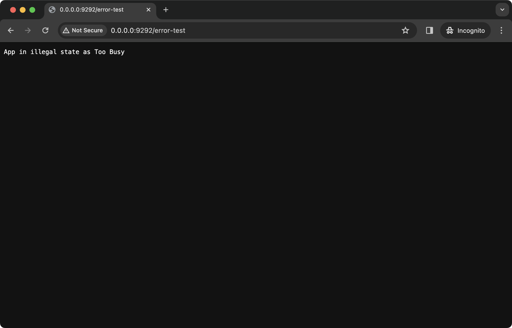