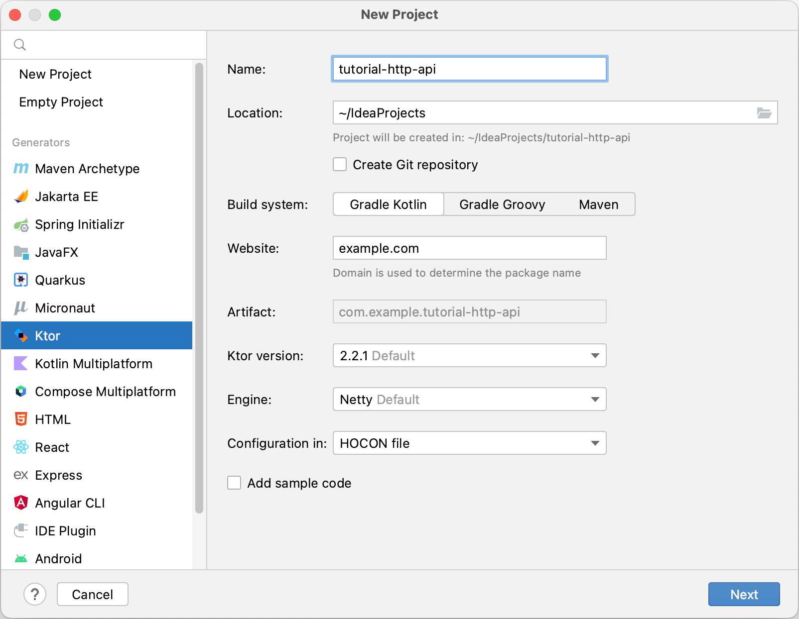
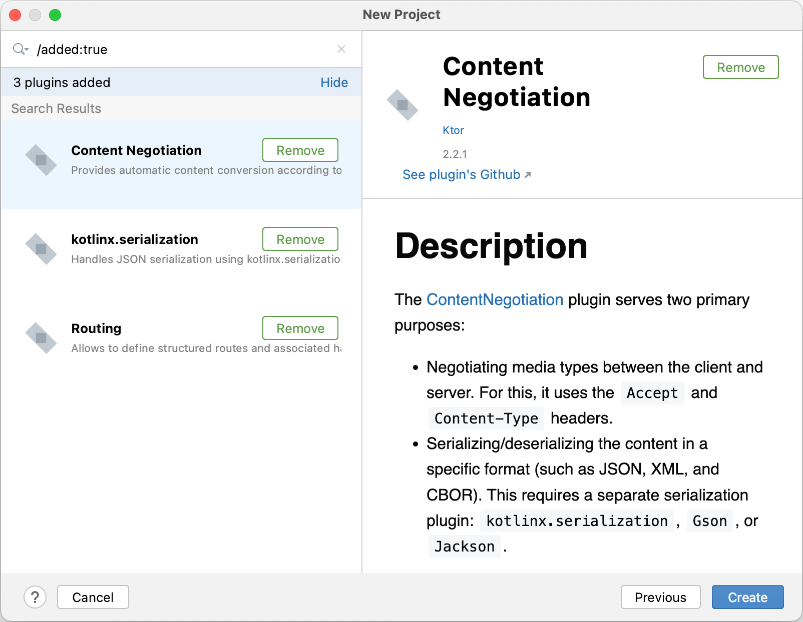
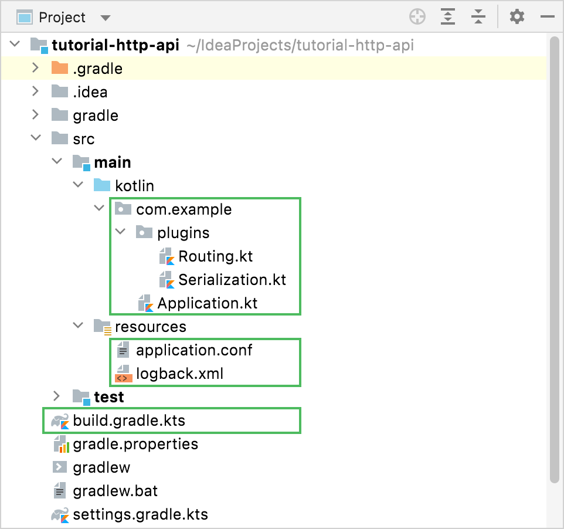

# Creating HTTP APIs

- https://ktor.io/docs/creating-http-apis.html

- 이 튜토리얼에서 우리는 HTTP API를 생성할 것이다. 이는 어플리케이션 백엔드에서 서비스를 수행한다. 
- 모바일, 웹, 데스크톱, B2B 서비스끼리 통신을 하게 된다. 
- 또한 어떻게 라우팅이 정의되는지, 그리고 구조화 되는지, 어떻게 직렬화 하는지에 대한 지루한 작업을 간소화 하는지 배운다. 
- 그리고 어떻게 수동/자동으로 우리 어플리케이션을 자동화 할지 테스트할 것이다. 

- 튜토리얼을 통해서 우리는 단순한 JSON API를 빌드할 것이고, 가상의 비즈니스의 고객 정보에 대해서 쿼리하도록 한다. 그리고 현재 이행하려는 주문에 대한 정보를 쿼리하도록 할 것이다. 
- 그리고 모든 고객 목록을 편리한 방법으로 빌드하고, 시스템에서 주문을 하고, 고객 각각의 정보와 주문에 대한 정보를 획득하도록 한다. 
- 새로운 엔트리는 추가하고, 오래된 엔트리는 삭제하도록 할 것이다. 

## Ktor 프로젝트 생성하기 

- kotlin 프로젝트 생성 페이지에서 Ktor를 위한 새로운 프로젝트를 생성한다. 
- IntelliJ 에서 다음과 같이 New Project wizard를 선택하고 Ktor 를 선택한다. 



- 프로젝트 생성정보 
  - Name: http-api
  - Location: 생성할 디렉토리명을 지정한다. 
  - Build System: Gradle Kotlin, Gradle Groovy, Maven 등과 같이 의존성 관리 시스템을 선택한다. (여기서는 Gradle Kotlin 선택)
  - Website: 기본으로 example.com으로 두어도 되고 원하는 도메인을 입력하자. 
  - Artifact: 아티팩트 이름을 지정한다. 
  - Ktor version: 가장 최신 버젼을 선택하면 된다. 
  - Engine: Netty 엔진을 사용하자. 
  - Configuration in: HOCON 을 선택해본다. YAML을 선택해도 된다. 
  - Add sample code: 이것은 샘플코드를 추가할지 여부이며, 여기서는 빼고 진행해본다. 

- 플러그인 추가하기 
  - Routing, Content Negotiation, Kotlin.serialization 플러그인을 선택한다. 



## 생성된 프로젝트 살펴보기

- 프로젝트 구조는 다음과 같다. 



- build.gradle.kts 파일은 Ktor 서버와 플러그인을 위한 의존성을 설정하는 곳이다. 
- main/resources 폴더는 설정 파일이 존재한다. 
- main/kotlin 폴더는 생성된 소스코드가 존재한다. 

### 의존성

- build.gradle.kts 파일을 열어보면 추가된 의존성 정보를 확인할 수 있다. 

```kt
dependencies {
    implementation("io.ktor:ktor-server-core-jvm")
    implementation("io.ktor:ktor-server-content-negotiation-jvm")
    implementation("io.ktor:ktor-serialization-kotlinx-json-jvm")
    implementation("io.ktor:ktor-server-netty-jvm")
    implementation("ch.qos.logback:logback-classic:$logback_version")
    testImplementation("io.ktor:ktor-server-test-host:$ktor_version")
    testImplementation("org.jetbrains.kotlin:kotlin-test-junit:$kotlin_version")
}
```

- 의존성 내용을 짧게 살펴보자. 
  - ktor-server-core-jvm: 
    - 이것은 Ktor의 핵심 컴포넌트이다. 
  - ktor-server-content-negotiation과 ktor-serialization-kotlinx-json-jvm: 
    - 이것은 객체를 JSON으로 직렬화된 형태로 변환하는 모듈이다. 
    - 이를 통해서 우리가 개발할 API의 출력 포맷을 지정하게되며, 여기서는 JSON 으로 구조화된 형태로 출력한다. 
    - ktor-serialization-ktolinx-json 을 이용하기 위해서 다음 직렬화 플러그인을 지정해야한다. 

    ```kt
      plugins {
          id("io.ktor.plugin") version "2.3.8"
      }
    ```

  - ktor-server-netty-jvm:
    - 프로젝트에 Netty 엔진을 사용한다는 의미이다. 
    - 외부 어플리케이션 컨테이너를 이용하지 않고 프로젝트 내부에서 직접 서버 기능을 구현하도록 해준다. 
  - logback-classic:
    - SLF4j 의 구현체를 제공하여, 잘 형식화된 로그를 콘솔에 출력하도록 해준다. 
  - ktor-server-test-host, hotlin-test-junit
    - Ktor 어플리케이션을 HTTP 스택을 갖추지 않고도 테스트하도록 해준다. 
    - 우리 프로젝트에서는 이를 이용하여 유닛 테스트를 구성할 것이다. 

### appliation.conf 와 logback.xml 구성하기 

- 일반적인 프로젝트에는 applicaiton.conf 와 logback.xml 설정 파일이 resource 폴더에 존재한다. 
- application.conf:
  - 이 설정 파일은 HOCON이라고 하는 형태로 되어 있다. 
  - Ktor은 이 파일을 이용하여 우리의 포트를 지정하거나, 어플리케이션의 엔드포인트 등을 지정할 수 있도록 해준다. 
  - 만약 Ktor server가 어떻게 설정되었는지에 대해서 알고 싶다면 https://ktor.io/docs/configuration-file.html 를 참조하자. 
- logback.xml 
  - 이것은 기본 로깅 구조를 지정하도록 해준다. 
  - 만약 logging에 대해서 더 배우고 싶다면 https://ktor.io/docs/logging.html 에서 확인하자. 

### 소스코드 

- application.conf 파일은 우리의 어플리케이션의 엔트로 포인트가 com.example.ApplicationKt.module 라는 것을 가리킨다. 
- 이에 상응하는 메소드가 Application.module() 함수이며 Application.kt 에 존재한다. 이것은 어플리케이션 모듈이된다. 

```kt
fun main(args: Array<String>): Unit = io.ktor.server.netty.EngineMain.main(args)

fun Application.module() {
    configureRouting()
    configureSerialization()
}
```

- 이 모듈에서는 다음 확장 함수가 포함되어 있다. 
  - configureRoting
    - 이는 plugins/Routing.kt 에 정의되어 있다. 이것은 아직 아무일도 하지 않는다. 

    ```kt
    fun Application.configureRouting() {
        routing {
        }
    }
    ```
    - 우리는 향후 customers와 orders를 위한 routes를 정의할 것이다. 
  - configureSerialization
    - 이 함수는 plugins/Serialization.kt 에 정의되어 있다. 
    - 이것은 ContentNegotiation과 json 직렬화를 설치한다. 

    ```kt
    fun Application.configureSerialization() {
        install(ContentNegotiation) {
            json()
        }
    }
    ```

## Customer Routes

- 우선 Customer  부분을 알아보자. 
- 우리는 model을 우선 생성하고, 고객에 대한 모델링을 할 것이다. 
- 또한 우리는 Customers를 추가, 목록조회, 살제를 수행하도록 엔드포인트를 생성할 것이다. 

### Create the Customer model

- 우리 케이스에서 customer는 몇가지 기본적인 정보를 가지고 있다. 
- 고객은 id를 이용하여 고객을 식별하고, first 이름과 last이름 그리고 메일주고를 가진다. 
- 모델링을 가장 쉽게 하기 위해서는 데이터 클래스를 이용할 것이다. 

1. new package 를 생성하고 이름을 models로 생성하자. 
2. Customer.kt 파일을 models에 생성하고, 다음과 같은 코드를 살펴보자. 

  ```kt
  package com.example.models

  import kotlinx.serialization.Serializable

  @Serializable
  data class Customer(val id: String, val firstName: String, val lastName: String, val email: String)
```

  - @Serializable 어노테이션은 kotlinx.serialization 에 이용한다. 
  - Ktor integration과 함께 이것을 통해 모델을 JSON으로 생성해주고 우리의 API의 응답으로 자동으로 반환하게 해준다. 

### Customer 스토리지 생성하가. 

- 복잡도를 줄이기 위해서, in-memory 저장소를 이용할 것이다. 이것은 Customer를 mutable list 를 이용하여 저장한다. 
- 실제 어플리케이션에서는 이 정보를 데이터베이스에 저장하고, 어플리케이션이 재시작 하더라도 유실되지 않도록 할 것이다. 
- Customer.kt 파일의 데이터 클래스 선언 바로 뒤에 다음 줄으 ㄹ추가할 수 있다. 

```kt
val customerStorage = mutableListOf<Customer>()
```

- 잘 정의된 Customer 클래스와 customer 객체를 저장할 장소를 얻게 되었다. 
- 이제는 엔드포인트를 생성하고, API로 노출하자. 

### customers를 위한 라우팅 지정하기

- 우리는 GET, POST, DELETE  요청을 /customer 엔드포인트를 통해 요청할 것이다. 
- 우리의 라우팅을 HTTP 메소드에 맞게 매핑할 것이다. 

1. routes라는 패키지를 생성하자. 
2. CustomerRoutes.kt 파일을 routes 패키지에 생성하고 다음 내용을 추가하자. 

```kt
package com.example.routes

import io.ktor.server.routing.*

fun Route.customerRouting() {
    route("/customer") {
        get {

        }
        get("{id?}") {

        }
        post {

        }
        delete("{id?}") {

        }
    }
}
```

- 이번 케이스에서 우리는 route 함수를 /customer 엔드포이늩 하위에 그룹화 할 것이다. 
- 그리고 각 HTTP 메소드 블록으 ㄹ생성했다. 
- 이것은 routes의 구조를 설정하기 위한 하나의 접근 방법이다. Order 를 생성할때 다른 접근 방법도 알아볼 것이다. 
- 여기서는 2개의 get 엔드 포인트를 정의했다. 하나는 path 파리미터 없이 작성했고 다른 하나는 {id?} 로 패스 파라미터를 지정했다. 
- 우리는 모든 고객의 목록을 첫번째 엔트리로 확인할 수 있을 것이다. 
- 그리고 두번쩨는 특정 하나의 고객을 조회한다. 

### customer 목록 조회하기 

- 모든 customer를 목록화 하기 위해서 customerStorage 리스트를 call.response 함수를 통해서 반환할 것이다. 
- 이것은 Kotlin객체를 획득하고, 이를 직렬화 한 특정 포맷으로 반환하게 된다. 
- get 핸들러는 다음과 같이 작성될 것이다. 

```kt
package com.example.routes

import com.example.models.*
import io.ktor.http.*
import io.ktor.server.application.*
import io.ktor.server.request.*
import io.ktor.server.response.*
import io.ktor.server.routing.*

fun Route.customerRouting() {
    route("/customer") {
        get {
            if (customerStorage.isNotEmpty()) {
                call.respond(customerStorage)
            } else {
                call.respondText("No customers found", status = HttpStatusCode.OK)
            }
        }
    }
}
```

- 이를 동작시키기 위해서 ContentNegotiation 플러그인이 필요하다. 
- 이것은 이미 인스톨 되어 있고 json serializer 가 이미 plugins/Serialization.kt 에 있다. 
- 그럼 contnet negotiation을 하는 일이 무엇인가? 
- 다음 요청을 살펴보자. 

```kt
GET http://127.0.0.1:8080/customer
Accept: application/json
```

- 클라이언트가 요청을 하면 컨텐츠 협상을 통해 서버는 Accept 헤더를 검사하고, 이 특정 유형의 컨텐츠를 제공할 수 있는지 확인하고, 결과를 반환할 수 있다. 
- JSON은 kotlinx.serialization에 의해서 생성된다. 
- 우리는 이전에 @Serializable 어노테이션을 Customer 데이터 클래스에 지정했다. 
- 이 의미는 Ktor가 Customer를 직렬화 하라는 의미가 된다. 

### 특정 Customer 반환하기 

- 다른 route는 특정 고객 하나만 고객 Id를 통해서 반환하기를 원하는 것이다. 

```kt
GET http://127.0.0.1:8080/customer/200
Accept: application/json
```

- Ktor 에서 경로에 파라미터를 포함하고 있다. 이는 path 일부로 포함되어 있다. 
- 색인화된 액세스 연산자(call.parameters["myParamName"])를 사용하여 해당 값에 액세스 할 수 있다. 
- 그리고 다음 코드를 get("{id?}") 엔트리에 추가하자. 

```kt
get("{id?}") {
    val id = call.parameters["id"] ?: return@get call.respondText(
        "Missing id",
        status = HttpStatusCode.BadRequest
    )
    val customer =
        customerStorage.find { it.id == id } ?: return@get call.respondText(
            "No customer with id $id",
            status = HttpStatusCode.NotFound
        )
    call.respond(customer)
}
```

- 요청에 id가 존재하는지를 검사하게 된다. 
- 만약 존재하지 않으면 400 Bad Request 상태 코드를 반환하고, 에러메시지를 반환한다. 
- 만약 파라미터가 존재한다면 customerStorage 에 해당하는 레코드를 find 하게 된다. 
- 반면 Customer이 없으면 404 "Not Found" 상태 코드를 에러 메시지와 반환한다. 

### customer 생성하기

- 다음으로 클라이언트가 클라이언트 객체의 JSON 표현을 POST를 구현한다. 
- 그리고 Customer 스토리지에 저장된다. 
- 그리고 다음과 같은 코드를 작성한다. 

```kt
post {
    val customer = call.receive<Customer>()
    customerStorage.add(customer)
    call.respondText("Customer stored correctly", status = HttpStatusCode.Created)
}
```

- call.receive 와 configured Content Negotiation 플러그인으로 통합한다. 
- 일반 매개변수인 Customer를 사용하여 이를 호출하면 JSON 요청 본문이 Kotlin Customer객체로 자동 역직렬화한다. 
- 그리고 저장소에 customer를 저장하고, 상태코드를 201 Created를 반환한다. 

- 이 포인트에서 스토리지에 동시에 액세스하는 여러 요청으로 인해 발생할 수 있는 문제를 의도적으로 살펴보고 있다는 점을 다시 강조할 가치가 있다. 
- 실제 제품에서 데이터 구조와 코드는 동시에 여러 요청/스레드에서 엑세스 할 수 있는 경우를 고려해야한다. 그러나 이 범윌르 벗어나는 것이 되므로 생략한다. 

### Customer 삭제하기 

- Customer 삭제 구현은 특정 고객을 나열하는 데 사용한 것과 유사한 절차를 따른다. 
- 먼저 ID를 얻은 다음 그에 따라 customerStorage를 수정한다. 

```kt
delete("{id?}") {
    val id = call.parameters["id"] ?: return@delete call.respond(HttpStatusCode.BadRequest)
    if (customerStorage.removeIf { it.id == id }) {
        call.respondText("Customer removed correctly", status = HttpStatusCode.Accepted)
    } else {
        call.respondText("Not Found", status = HttpStatusCode.NotFound)
    }
}
```

- get 요청의 정의와 유사하게 우리는 id는 널이 아니어야한다. 
- 만약 id가 없다면 400 Bad Request 에러를 반환한다. 

### routes 등록하기 

- 지금까지 Route의 확장 기능 내에서만 경로를 정의했으므로 Ktor는 아직 경로에 대해 알지 못하므로 이를 등록해야한다. 
- Plugins/Routeing.kt 파일을 열고 다음 코드를 추가하자. 

```kt
package com.example.plugins

import com.example.routes.*
import io.ktor.server.application.*
import io.ktor.server.routing.*

fun Application.configureRouting() {
    routing {
        customerRouting()
    }
}
```

- 기억해야할 것은 configureRouting 함수는 이미 Application.module() 함수에 설치되어 있다. 
- 우리는 이미 customer-related 라우트에 대해서 구현을 완료했다. 

## Order routes

- Customer API 엔드포인트가 완료 되었으니, 이제는 Orders를 알아보자. 
- 거의 유사한 구현 방법을 사용하지만 application reoutes 구조에 대해 다른 방법을 살펴볼 것이다. 
- 그리고 order에서 개별적인 아이템의 조각을 합쳐 볼 것이다. 

### Order model 생성하기 

- 시스템에 저장하려면 주문은 주문번호(대시포함)로 식별할 수 있어야 하며 주문 항목 목록을 포함해야한다. 
- 이 주문 항목에는 텍스트 설명, 이 항목이 주문에 나타나는 빈도 수, 개별 항목의 가격(요청 시 주문의 총 가격을 계산할 수 있도록)이 있어야한다. 
- 모델 패키지 내에서 Order.kt 라는 새 파일을 생성하고 두 데이터 클래스의 정의로 채운다. 

```kt
package com.example.models

import kotlinx.serialization.Serializable

@Serializable
data class Order(val number: String, val contents: List<OrderItem>)

@Serializable
data class OrderItem(val item: String, val amount: Int, val price: Double)
```

- 또한 주문을 저장할 장소가 다시 한 번 필요하다. 
- POST 경로를 정의할 필요를 건너뛰기 위해서 (고객 경로의 지식을 사용하여 직접 시도하는 것이 좋다.) 
- 우리는 몇가지 샘플 주문으로 orderStorage를 미리 채울 것이다. 
- Order.kt 파일 내부에 최상위 선언으로 정의할 것이다. 

```kt
val orderStorage = listOf(Order(
    "2020-04-06-01", listOf(
        OrderItem("Ham Sandwich", 2, 5.50),
        OrderItem("Water", 1, 1.50),
        OrderItem("Beer", 3, 2.30),
        OrderItem("Cheesecake", 1, 3.75)
    )),
    Order("2020-04-03-01", listOf(
        OrderItem("Cheeseburger", 1, 8.50),
        OrderItem("Water", 2, 1.50),
        OrderItem("Coke", 2, 1.76),
        OrderItem("Ice Cream", 1, 2.35)
    ))
)
```

### order에 대한 routing 정의하기 

- 우리는 3가지 다른 패턴으로 일련의 GET 요청에 응답하자. 

```kt
GET http://127.0.0.1:8080/order
Content-Type: application/json

###
GET http://127.0.0.1:8080/order/2020-04-06-01
Content-Type: application/json

###
GET http://127.0.0.1:8080/order/2020-04-06-01/total
Content-Type: application/json
```

- 첫번째는 모든 주문을 반환하고, 두번째는 ID가 지정된 주문을 반환하고, 세번째는 총 주문(개별 OrderItem의 가격에 각 항목수를 곱한 값)을 반환한다. 
- 주문의 경우 경로를 정의할 때 다른 패턴을 따른다. 
- 다양한 HTTP 메소드를 사용하여 단일 경로 기능으로 모든 경로를 그룹화 하는 대신 개별 기능을 사용한다. 

### 모든 그리고 각각의 order 조회하기 

- 모든 주문을 조회하기 위해 고객과 동일한 패턴을 따른다. 차이점이 있다면 자체 기능에서 이를 정의한다는 것이다. 
- 경로 패키지 내에 OrderRoutes.kt 라는 파일을 만들고 listOrdersRoute()라는 함수 내에서 경로 구현부터 시작하자. 

```kt
package com.example.routes

import com.example.models.*
import io.ktor.server.application.*
import io.ktor.http.*
import io.ktor.server.response.*
import io.ktor.server.routing.*

fun Route.listOrdersRoute() {
    get("/order") {
        if (orderStorage.isNotEmpty()) {
            call.respond(orderStorage)
        }
    }
}
```

- 우리는 고객과 유사한 구현을 통해 개별 주문에 동일한 구조를 적용하지만 자체 기능으로 캡슐화 한다. 

```kt
fun Route.getOrderRoute() {
    get("/order/{id?}") {
        val id = call.parameters["id"] ?: return@get call.respondText("Bad Request", status = HttpStatusCode.BadRequest)
        val order = orderStorage.find { it.number == id } ?: return@get call.respondText(
            "Not Found",
            status = HttpStatusCode.NotFound
        )
        call.respond(order)
    }
}
```

### 주문 토탈 

- 주문 총액을 구하는 것은 주문 항목을 반복하고 이를 합산하는 것으로 구성된다. 
- totalizeOrderRoute 함수로 구현되면 다음과 같으며 합산 프로세스 외에도 이미 익숙해 보일 것이다. 

```kt
fun Route.totalizeOrderRoute() {
    get("/order/{id?}/total") {
        val id = call.parameters["id"] ?: return@get call.respondText("Bad Request", status = HttpStatusCode.BadRequest)
        val order = orderStorage.find { it.number == id } ?: return@get call.respondText(
            "Not Found",
            status = HttpStatusCode.NotFound
        )
        val total = order.contents.sumOf { it.price * it.amount }
        call.respond(total)
    }
}
```

- 여기서 주목해야 할 작은 점은 매개변수에 대한 경로의 접미사에만 국한되지 않는다는 것이다. 
- 보다시피 중간에 있는 섹션이 경로 매개변수 (/order/{id}/total) 가 되는 것이 가능하다. 

### routes 등록하기 

- 마지막으로 고객의 경우와 마찬가지로 경로를 등록해야한다. 
- 이를 통해 경로 수가 증가함에 따라 경로를 그룹화 하는 것이 더 의미 있는 이유를 명확히 알 수 있다. 
- 여전히 플러그인 /Routing.kt 에서 다음과 같이 주문 경로를 추가한다. 

```kt
package com.example.plugins

import com.example.routes.*
import io.ktor.server.application.*
import io.ktor.server.routing.*

fun Application.configureRouting() {
    routing {
        customerRouting()
        listOrdersRoute()
        getOrderRoute()
        totalizeOrderRoute()
    }
}
```

- 이제 모든것이 연결되었으므로 마침내 애플리케이션 테스트를 시작하고 모든 것이 예상대로 작동하는지 확인할 수 있다. 

## 수동으로 HTTP 엔드포인트 테스트하기 

- 이제 모든 엔드포인트가 준비되었으므로 애플리케이션을 테스트할 차례이다. 
- GET 요청을 테스트하기 위해 어떤 브라우저든 사용할 수 있지만 HTTP 메소드를 테스트하렴녀 별도의 도구가 필요하다. 
  - IntelliJ IDEA Ultimate 를 사용하는 경우 .http 파일을 지원하는 클라이언트가 이미 있으므로 요청을 지정하고 실행할 수 있다. 
  - IntelliJ IDEA 커뮤니티 또는 다른 IDE를 사용하는 경우 curl을 사용하여 API를 테스트할 수 있다. 

### customer HTTP 테스트 파일을 생성하자. 

- CustomerTest.http 파일을 프로젝트 루트에 생성하자. 

```kt
POST http://127.0.0.1:8080/customer
Content-Type: application/json

{
  "id": "100",
  "firstName": "Jane",
  "lastName": "Smith",
  "email": "jane.smith@company.com"
}


###
POST http://127.0.0.1:8080/customer
Content-Type: application/json

{
  "id": "200",
  "firstName": "John",
  "lastName": "Smith",
  "email": "john.smith@company.com"
}

###
POST http://127.0.0.1:8080/customer
Content-Type: application/json

{
  "id": "300",
  "firstName": "Mary",
  "lastName": "Smith",
  "email": "mary.smith@company.com"
}


###
GET http://127.0.0.1:8080/customer
Accept: application/json

###
GET http://127.0.0.1:8080/customer/200
Accept: application/json

###
GET http://127.0.0.1:8080/customer/500
Accept: application/json

###
DELETE http://127.0.0.1:8080/customer/100

###
DELETE http://127.0.0.1:8080/customer/500
```

### Curl 로 작성하기 

```kt
curl -X POST --location "http://127.0.0.1:8080/customer" \
    -H "Content-Type: application/json" \
    -d "{
          \"id\": \"100\",
          \"firstName\": \"Jane\",
          \"lastName\": \"Smith\",
          \"email\": \"jane.smith@company.com\"
        }"

curl -X POST --location "http://127.0.0.1:8080/customer" \
    -H "Content-Type: application/json" \
    -d "{
          \"id\": \"200\",
          \"firstName\": \"John\",
          \"lastName\": \"Smith\",
          \"email\": \"john.smith@company.com\"
        }"

curl -X POST --location "http://127.0.0.1:8080/customer" \
    -H "Content-Type: application/json" \
    -d "{
          \"id\": \"300\",
          \"firstName\": \"Mary\",
          \"lastName\": \"Smith\",
          \"email\": \"mary.smith@company.com\"
        }"

curl -X GET --location "http://127.0.0.1:8080/customer" \
    -H "Accept: application/json"

curl -X GET --location "http://127.0.0.1:8080/customer/200" \
    -H "Accept: application/json"

curl -X GET --location "http://127.0.0.1:8080/customer/500" \
    -H "Accept: application/json"

curl -X DELETE --location "http://127.0.0.1:8080/customer/100"

curl -X DELETE --location "http://127.0.0.1:8080/customer/500"
```

- 이 파일 내에서 이제 API 에서 지원되는 모든 HTTP 메서드를 사용하여 여러 HTTP 요청을 지정했다. 
- 이제 IntelliJ IDEA를 사용하면 이러한 각 요청을 개별적으로 또는 모두 함께 실행할 수 있다. 

### Order 엔드포인트 

- order 엔드포인트에 대해서 동일한 절차를 따른다. OrderTest.http파일을 생성하고 다음과 같이 작성하자. 

```kt
GET http://127.0.0.1:8080/order
Content-Type: application/json

###
GET http://127.0.0.1:8080/order/2020-04-06-01
Content-Type: application/json

###
GET http://127.0.0.1:8080/order/2020-04-06-01/total
Content-Type: application/json
```

### curl 로 요청하기 

```kt
GET http://127.0.0.1:8080/order
Content-Type: application/json

###
GET http://127.0.0.1:8080/order/2020-04-06-01
Content-Type: application/json

###
GET http://127.0.0.1:8080/order/2020-04-06-01/total
Content-Type: application/json
```

- 이전 요청과 마찬가지로 이러한 요청을 실행하면 예상되는 출력(주문목록, 하나의 주문에 대한 정보 및 주문 총액)이 표시된다. 

## 자동화된 테스트 

- 수동 테스트는 훌륭하고 필요하지만 엔드포인트에 대한 자동화된 테스트를 수행하는 것도 의미가 있다. 
- Ktor를 사용하면 testApplication 함수를 사용하여 전체 기본엔진(Netty) 를 시작하지 않고도 엔드포인트를 테스트할 수 있다. 
- 이 함수 내부에서 기존 Ktor 클라이언트 인스턴스를 사용하여 서버에 요청하고 결과를 확인해야한다. 
- 주문 경로가 올바른 형식의 JSON 콘텐츠를 반환하는지 확인하는 단위 테스트를 작성해보자. 
- src/test/kotlin/com/example/ApplicationTest.kt 파일을 열고 기존 테스트 클래스를 OrderRoute Tests로 바꾼다. 

```kt
package com.example

import io.ktor.client.request.*
import io.ktor.client.statement.*
import io.ktor.http.*
import io.ktor.server.testing.*
import kotlin.test.*

class OrderRouteTests {
    @Test
    fun testGetOrder() = testApplication {
        val response = client.get("/order/2020-04-06-01")
        assertEquals(
            """{"number":"2020-04-06-01","contents":[{"item":"Ham Sandwich","amount":2,"price":5.5},{"item":"Water","amount":1,"price":1.5},{"item":"Beer","amount":3,"price":2.3},{"item":"Cheesecake","amount":1,"price":3.75}]}""",
            response.bodyAsText()
        )
        assertEquals(HttpStatusCode.OK, response.status)
    }
}
```

- 참고: 프로젝트를 생성할 때 구성 옵션을 코드로 설정한 경우 테스트 애플리케이션에 모듈을 수동으로 추가해야한다. 

```kt
application {
    configureRouting()
    configureSerialization()
}
```

- 문자열에는 키와 값(예 "숫자") 주위에 많은 따옴표가 포함되어 있으므로 삼중 따옴표(""") 를 사용하여 원시 문자열을 사용하기에 좋은 장소이다. 
- 문자열 안에 모든 특수 문자를 개별적으로 이스케이프 처리해야하는 번거로움을 덜어준다. 

- 이제 IDEA에서 단위 테스트를 실행하고 결과를 확인할 수 있다. 
- 이 엔드포인트에 대해 수행한 것과 마찬가지로 다른 모든 엔드포인트를 테스트로 추가하고 HTTP API테스트를 자동화할 수 있다. 

- 이렇게 해서 우리는 작은 JSON기반 HTTP API구축을 완료했다. 
