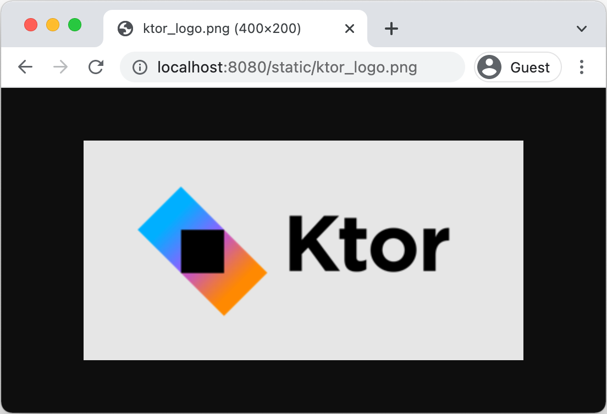

# Creating a static website

from: https://ktor.io/docs/creating-static-website.html

- 이 아티클에서 단순한 블로그 어플리케이션을 생성하는 것을 보여준다. 
  - 첫번재 정적 컨텐트 (이미지, HTML)를 호스트한다. 
  - 다음 튜토리얼에는 인터렉티브 어플리케이션을 이용하여 FreeMarker 템플릿 엔진을 이용한다. 
  - 최종적으로 Exposed 프레임워크를 이용하여 데이터 저장을 수행할 것이다. 

## Ktor 프로젝트 생성하기 

- Ktor 플러그인을 이용하여 프로젝트를 생성할 것이다. 
- 프로젝트 이름: Tutorial-website
- Build system: Gradle Kotlin
- Website: example.com
- Kotlin version: 최신버젼
- Engine: Netty
- Configuration in: HOCON 파일
- Add sample code: Disable

- 의존성:
  - Routing
  - Static Content
  - Freemarker

## 프로젝트 예제 

- 생성된 프로젝트의 구조를 살펴보면 다음과 같다. 


- build.gradle.kts 파일은 Ktor 서버와 plugins는 의존성을 포함한다. 
- main/resources 폴더에는 설정 파일을 포함한다. 
- main/kotlin 폴터는 소스 코드가 포함되어 있다. 

### 의존성

- build.gradle.kts 파일을 열고 다음과 같은의존성을 확인하자. 

```kt
dependencies {
    implementation("io.ktor:ktor-server-core-jvm")
    implementation("io.ktor:ktor-server-freemarker-jvm")
    implementation("io.ktor:ktor-server-netty-jvm")
    implementation("ch.qos.logback:logback-classic:$logback_version")
    testImplementation("io.ktor:ktor-server-tests-jvm")
    testImplementation("org.jetbrains.kotlin:kotlin-test-junit:$kotlin_version")
}

```

- 이제 이 의존선을 하나하나 알아보자. 
  - ktor-server-core-jvm은 Ktor의 핵심 컴포넌트를 가진다. 
  - ktor-server-freemarker-jvm은 FreeMarker 템플릿 엔진을 이용하여 우리의 저널의 메인페이지를 생성한다. 
  - ktor-server-netty-jvm은 Netty 엔진을 우리 프로젝트에 추가하였다. 이를 통해 외부 애플리케이션 컨테이너에 의존하지 않고도 서버 기능을 사용할 수 있게 한다. 
  - logback-classic 은 SLF4j 의 구현체를 제공하며, 로그를 콘솔에 이쁘게 노출한다. 
  - ktor-server-test-jvm가 kotlin-test-junit 는 Ktor 어플리케이션의 테스트 파트를 제공하며, 프로세스에서 HTTP 스택 전체를 이용할 수 있도록 해준다. 

### application.conf, logback.xml 설정

- 생성된 프로젝트는 또한 application.conf와 logback.xml 설정 파일을 가지고 있다. 이 파일은 resources 폴더 하위에 존재한다. 
  - application.conf는 HOCON 포맷으로 설정을 한다. Ktor는 어플리케이션의 엔트리 포인트를 정의하고, 어플리케이션이 특정 포트로 수행할 수 있도록 설정한다. 

    ```kt
    ktor {
        deployment {
            port = 8080
            port = ${?PORT}
        }
        application {
            modules = [ com.example.ApplicationKt.module ]
        }
    }
    ```
    - 만약 어떻게 Ktor 서버가 설정되어 있는지 배우고자 한다면 https://ktor.io/docs/configuration-file.html 을 살펴보라. 
  - logback.xml 은 서버에 대한 기본 로깅을 설정한다. 만약 Ktor의 로깅에 대해서 더 많은 것을 알고자 한다면 https://ktor.io/docs/logging.html 을 보자. 

### Source code

- application.conf 파일은 어플리케이션의 엔트리 포인트를 설정한다. 이것은 com.example.AppliationKt.module 에 대해서 수행한다. 
- 이 것은 Application.module() 함수로 Application.kt 에 존재한다. 이것은 어플리케이션의 module이다. 

```kt
fun main(args: Array<String>): Unit = io.ktor.server.netty.EngineMain.main(args)

fun Application.module() {
    configureRouting()
    configureTemplating()
}
```

- 이 모듈은 다음 확장 함수를 호출한다. 
  - configureRouting은 plugins/Routing.kt 에 정의된 함수이며, 처음에는 아무일도 수행하지 않는다. 

    ```kt
    fun Application.configureRouting() {
        routing {
        }
    }
    ```

  - configureTemplate는 plugins/Templating.kt 에 정의되어 있으며 이는 FreeMaker 플러그 인을 설정하고 인스톨한다. 

    ```kt
    fun Application.configureTemplating() {
        install(FreeMarker) {
            templateLoader = ClassTemplateLoader(this::class.java.classLoader, "templates")
        }
    }
    ```
  - 우리는 FreeMarker Template를 이용하는 것은 다음 튜토리얼에 보여준다. 
  - https://ktor.io/docs/creating-interactive-website.html

## 정적 파일과 페이지 

- dynamic 어플리케이션으로 뛰어들기 전에 좀더 쉽지만 그만큼 중요한 작업부터 시작하자. 
- Ktor가 일부 정적 파일을 제공하자. 
- 우리 저널의 맥락에서 우리가 정적 파일로 제공하고 싶은 것들이 많이 있을 것이다. 
- 한가지 예는 헤더 이미지(사이트 식별 로고) 이다. 

  - 1. src/amin/resources 내부에 files디렉토리를 생성한다. 
  - 2. ktor_logo.png 이미지 파일을 다운로드 하고 files폴더에 추가한다. 
  - 3. 정적 컨텐츠를 제공하기 위해서 staticResources로 이름지어진 함수에 라우팅을 추가한다. 함수는 2개의 파라미터를 가진다. 정적 컨텐츠를 사용할 수 있는 경로와 콘텐츠가 제공되어야 하는 위치를 정의할 수 있는 람다이다. 

  - plugins/Routing.kt 파일에서 Application.configureRouting()의 구현체를 바꿔보자. 

    ```kt
    import io.ktor.server.application.*
    import io.ktor.server.http.content.*
    import io.ktor.server.routing.*

    fun Application.configureRouting() {
        routing {
            staticResources("/static", "files")
        }
    }
    ```

  - 이는 URL /static 아래의 모든 항목이 리소스 내부의 파일 디렉토리를 사용하여 제공되어야 함을 Ktor에 지시한다. 

### 어플리케이션 실행 

- 애플리케이션이 예상대로 작동하는지 살펴보자. 
- Application.kt에서 fun main(...) 옆에 있는 Run 버튼을 눌러 애플리케이션을 실행할 수 있다. 


- IntelliJ IDEA 은 어플리케이션을 실행한다. 그리고 몇초후에 다음 설정 정보와 함게 출력을 확인할 수 있다. 

```kt
[main] INFO  Application - Responding at http://0.0.0.0:8080
```

- http://localhost:8080/static/ktor_logo.png 은 다음 브라우저에 오픈하자. 다음과 같은 화면을 볼 수 있을 것이다. 



### Add HTML page

- 물론 이미지만 국한되지 않는다. HTML 파일이나 CSS 및 JavaScript도 잘 작동한다. 
- 우리는 이 사실을 활용하여 저널 애플리케이션의 첫 번째 실제 부분으로 작은 "내 소개" 페이지를 추가할 수 있다. 이 페이지는 우리, 이 프로젝트 또는 우리가 좋아할 만한 모든 정보를 포함할 수 있는 정적 페이지이다. 

- 이를 위해 src/main/resources/files 안에 aboutme.html 이라는 새 파일을 만들고 다음 내용으로 채워볼 것이다. 

```html
<!DOCTYPE html>
<html lang="en">
<head>
    <meta charset="UTF-8">
    <title>Kotlin Journal</title>
</head>
<body style="text-align: center; font-family: sans-serif">

<h1>About me</h1>
<p>Welcome to my static page!</p>
<p>Feel free to take a look around.</p>
<p>Or go to the <a href="/">main page</a>.</p>
</body>
</html>
```

- 만약 application을 실행하고 http://localhost:8080/static/aboutme.html 을 가보면 다음과 깉은 페이지를 볼 수 있다. 


- 물론 파일 내부의 하위 디렉토리에 파일을 구성할 수도 있다. 
- Ktor는 이러한 경로를 올바른 URL에 자동으로 매핑한다. 

- 그러나 몇 개의 단락을 포함하는 정적 페이지는 아직 저널이라고 부르기 어렵다. 
- 계속해서 템플릿이 동적 콘텐츠가 포함된 페이지를 작성하는 데 어떻게 도움이 되는지, 그리고 애플리케이션 내에서 이를 제어하는 방법에 대해 알아보자. 
