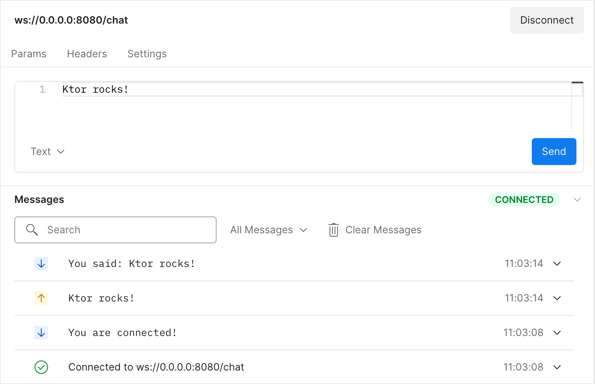

# Creating a WebSocket chat

- from: https://ktor.io/docs/creating-web-socket-chat.html
- 이번 튜토리얼에서는 WebSockets를 이용하여 단순한 채팅 어플리케이션을 어떻게 만드는지 알아본다. 
- chat server application: 은 사용자로부터 연결을 수행하고, 메시지를 수신받고, 모든 연결된 클라이언트에 메시지를 보낸다. 
- chat client application: 챗 서버와 연동하고, 메시지를 보내거나, 메시지를 수신받는다. 


- Ktor 는 서버와 클라이언트 측 프레임워크이기 때문에 튜토리얼의 이 부분에서 얻은 지식을 클라이언트측 구현에 재 사용하게 된다. 
  - WebSocket을 Ktor를 이용하여 동작하게 한다. 
  - 클라이언트와 서버 사이에 정보를 교환한다. 
  - 복수의 WebSocket 커넧션들을 동시에 관리한다. 

## Why WebSockets?

- 웹 소켓은 채팅이나 간단한 게임과 같은 애플리케이션에 매우 적합하다. 
- 채팅 세션은 일반적으로 오래 지속되며 클라이언트는 오랜 기간 동안 다른 참가자로 부터 메시지를 받는다. 
- 이러한 채팅 세션은 양방향으로 작동하므로 클라이언트가 채팅 메시지를 보내고 받을 수 있다. 

- 표준 HTTP 요청과 달리 WebSocket연결은 장기간 열려 있을 수 있으므로 프레임을 통해 클라이언트와 클라이언트와 서버 간의 데이터 교환을 위한 간단한 인터페이스를 제공한다. 
- 프레임을 다양한 유형(text, binary, close, ping/pong) 으로 제공되는 WebSocket 메시지로 생각할 수 있다. 
- Ktor는 WebSocket 프로토콜에 대한 높은 수준의 추상화를 제공하므로, 텍스트 및 바이너리 프레임 처리에 집중할 수 있고 Ktor 는 다른 프레임 유형 관리를 담당한다. 

- 또한 WebSocket은 널리 지원되는 기술이다. 모든 최신 브라우저는 기본적으로 WebSocket을 지원하며 많은 프로그래밍 언어와 플랫폼에는 기존 지원이 있다. 

## Ktor 프로젝트 생성하기 

- Name: 프로젝트 이름 지정
- Location: 프로젝트 디렉토리 지정
- Build System: Gradle Kotlin 등과 같은 빌드 시스템이다. 
- Website: 유니트하게 프로젝트를 구분할 수 있는 패키지 이름을 지정한다. 
- Artifact: 이 필드는 아티팩트 이름이다. 
- Ktor version: 가장최근 버젼을 선택한다. 
- Engine: 기본적으로 Netty 로 놔둔다. 
- Configuration in: HOCON 파일을 선택하여 설정을 수행한다. 
- Add sample code: 플러그인에 대한 샘플 코드를 추가할지 여부를 선택한다. 여기서는 disable한다. 

- 플러그인
  - WebSockets
  - Routing

## 예제 프로젝트 

- 다음은 예제 프로젝트 샘풀이다. 


- build.gradle.kts 파일 로 의존성 파일을 지정하고 플러그인을 설정한다. 
- main/resources 폴더로 설정파일을 포함한다. 
- main/kotlin 폴더는 생성된 코드가 위치한다. 

### 의존성 

- 첫번째, build.gradle.kts 파일을 열고 다음 의존성을 추가한다. 

```kt
dependencies {
    implementation("io.ktor:ktor-server-core-jvm")
    implementation("io.ktor:ktor-server-websockets-jvm")
    implementation("io.ktor:ktor-server-netty-jvm")
    testImplementation("io.ktor:ktor-server-tests-jvm")
    testImplementation("org.jetbrains.kotlin:kotlin-test-junit:$kotlin_version")
}
```

- ktor-server-core-jvm 은 프로젝트 핵심 컴포넌트이다. 
- ktor-server-websockets-jvm 은 WebSocket 플러그인을 통해서 채팅 매커니즘을 지원한다. 
- ktor-server-netty-jvm 은 프로젝트 Netty 엔진이며, 외부 어플리케이션 컨테이너없어도 네티 서버를 사용할 수 있도록 한다. 
- ktor-server-tests-jvm 과 kotlin-test-junit 은 Ktor 어플리케이션의 테스트 부분으로 HTTP 스택을 테스트할 수 있다. 

### 설정: application.conf 와 logback.xml

- application.conf와 logback.xml 는 resources 폴더에 포함되며, 이를 통해 설정을 한다. 
  - application.conf는 HOCON 형식으로 설정을 한다. Ktor는 이 파일을 이용하여 서버 포트와 어플리케이션 엔트리 포인트를 지정한다. 

    ```kt
    ktor {
        deployment {
            port = 8080
            port = ${?PORT}
        }
        application {
            modules = [ com.example.ApplicationKt.module ]
        }
    }
    ```

    - Ktor 서버는 구성 방법에 대해 자세히 알아보려면 파일의 구성 도움말 항목을 참조하라. 
  - logback.xml 은 서버의 로깅을 구성한다. 이 설정은 https://ktor.io/docs/logging.html 를 참조하자. 

### 소스코드 

- application.conf 파일은 어플리케이션의 엔트리 포인트를 com.example.ApplicationKt.module 를 지정한다. 이는 Application.module() 함수에 상응하며 Application.kt 파일에 존재한다. 

```kt
fun main(args: Array<String>): Unit = io.ktor.server.netty.EngineMain.main(args)

fun Application.module() {
    configureRouting()
    configureSockets()
}
```

- 이 모듈은 다음 확장 함수를 호출한다. 
  - configureRouting은 plugins/Routing.kt 에 정의되며, 현재는 아무것도 하지 않는다. 

    ```kt
    fun Application.configureRouting() {
        routing {
        }
    }
    ```

  - configureSockets은 plugins/Sockets.kt 에 정의한 함수이며, WebSocket 플러그인을 설치하고, 설정한다. 

    ```kt
    fun Application.configureSockets() {
        install(WebSockets) {
            pingPeriod = Duration.ofSeconds(15)
            timeout = Duration.ofSeconds(15)
            maxFrameSize = Long.MAX_VALUE
            masking = false
        }
        routing {
        }
    }
    ```

## 첫번째 echo 서버 

### echo 서버 구현하기 

- WebSocket 연결을 허용하고 텍스트 콘텐츠를 수신하여 클라이언트에 다시 보내는 "echo" 서비스를 구축하는 것부터 시작하자. 
- Ktor로 이 서비스를 구현하려면 Plugins/Sockets.kt 에 Application.configureSockets()에 대한 다음 구현을 추가하자. 

```kt
import io.ktor.websocket.*
import io.ktor.server.application.*
import io.ktor.server.routing.*
import io.ktor.server.websocket.*

fun Application.configureSockets() {
    install(WebSockets) {
        // ...
    }
    routing {
        webSocket("/chat") {
            send("You are connected!")
            for(frame in incoming) {
                frame as? Frame.Text ?: continue
                val receivedText = frame.readText()
                send("You said: $receivedText")
            }
        }
    }
}
```

- 우선 Ktor는 WebSocket 프로토콜(이 경우 경로는 /chat) 에 응답하는 엔드포인트로의 라우팅을 활성화하기 위해 WebSockets플러그인을 서버에 설치한다. 
- WebSocket 경로 기능 범위 내에서 Ktor는 클라이언트와 상호 작용하기 위한 다양한 방법에 대한 액세스를 제공한다. (DefauiltWebScoketServerSession 수싵기 유형을 통해).
- 여기에는 메시지를 보내고 수신된 메시지를 바복하는 편리한 방법이 포함된다. 

- 수신 채널을 반복할  때 서버는 수신된 프레임이 텍스트 유형인지 확인한 다음 텍스트를 읽고 접두사 "You did:"를 사용하여 사용자에게 다시 보낸다. 

- 이를 통해 완벽하게 작동하는 에코 서버를 구축했다. 

### Test the application

- 애플리케이션을 테스트하려면 Postmap과 같은 웹기반 WebSocket 클라이언트를 사용하여 에코 서비스에 연결하고, 메시지를 보내고, 에코된 응답을 받는다. 

- 서버를 시작하려면 Application.kt의 기본 기능 옆에 있는 여백 아이콘을 클릭하세요.
- 프로젝트 컴파일이 완료되면 IntelliJ IDEA의 실행 도구 창에 서버가 실행 중이라는 확인 메시지가 표시된다. 

```kt
Application - Responding at http://0.0.0.0:8080
```

- 이제 웹 기반 클라이언트를 사용하여 wa://localhost:8080/chat 에 연결하고 WebSocket 요청을 할 수 있다. 



- 메시지를 입력하고 로컬 서버로 보낸다. 
- 그러면 메시지 창에 보내고 받은 메시지가 표시되어 에코 서버가 의도한 대로 작동하고 있다. 
- 이제 WebSocket을 통해 양방향 통신을 설정하기 위한 견고한 기반이 마련되었다. 
- 다음 장에서는 여러 참가자가 서로 메시지를 보낼 수 있도록 애플리케이션을 확장한다. 

## 메시지 교환하기 

- 여러 사용자 간의 메시지 교환을 활성화하려면 각 사용자의 메시지에 해당 사용자 이름이 라벨로 지정되어 있는지 확인하자. 
- 추가적으로 메시지가 연결된 다른 모든 사용자에게 전송되어 효과적으로 브로드캐스팅되도록 할 수 있다. 

### 모델 연결

- 이 두 기능 모두 서버가 보유하고 있는 뎐결을 추작해야한다. 
- 즉 어떤 사용자가 메시지를 보내고 있는지, 누구에게 메시지를  브로드캐스트할지 알아야한다. 

- Ktor는 수신 및 발신 채널, 편리한 통신 방법 등과 같은 WebSocket 통신에 필요한 모든 구성 요소를 포함하는 DefaultWebSocketSession개체를 사용하여 WebSocket연결을 처리한다. 
- 사용자 이름 할당 작업을 단순화하기 위한 한가지 솔루션은 카운터를 기반으로 참가자의 사용자 이름을 자동으로 생성하는 것이다. 
- com.example 패키지에 새로운 파일을 생성하고 Connection.kt을 추가하고 다음과 같이 작성하자. 

```kt
package com.example

import io.ktor.websocket.*
import java.util.concurrent.atomic.*

class Connection(val session: DefaultWebSocketSession) {
    companion object {
        val lastId = AtomicInteger(0)
    }
    val name = "user${lastId.getAndIncrement()}"
}
```

- AtomicInteger는 카운터의 스레드로부터 안전한 데이터 구조로 사용된다. 
- 이렇게 하면 두 사용자가 별도의 스레드에서 동시에 Connection 객체를 생성하더라도 사용자 이름에 대해 동일한 ID를 받을 수 없다. 

### 연결 처리 및 메시지 전파 구현

- 이제 연결 개체를 추적하고 올바른 사용자 이름 앞에 붙은 메시지를 연결된 모든 클라이언트에 보내도록 서버를 조정할 수 있다. 
- 플러그인/Sockets.kt 의 라우팅 블록 구현을 다음과 같이 조정한다. 

```kt
import com.example.*
import io.ktor.websocket.*
import io.ktor.server.application.*
import io.ktor.server.routing.*
import io.ktor.server.websocket.*
import java.time.*
import java.util.*
import kotlin.collections.LinkedHashSet

fun Application.configureSockets() {
    routing {
        val connections = Collections.synchronizedSet<Connection?>(LinkedHashSet())
        webSocket("/chat") {
            println("Adding user!")
            val thisConnection = Connection(this)
            connections += thisConnection
            try {
                send("You are connected! There are ${connections.count()} users here.")
                for (frame in incoming) {
                    frame as? Frame.Text ?: continue
                    val receivedText = frame.readText()
                    val textWithUsername = "[${thisConnection.name}]: $receivedText"
                    connections.forEach {
                        it.session.send(textWithUsername)
                    }
                }
            } catch (e: Exception) {
                println(e.localizedMessage)
            } finally {
                println("Removing $thisConnection!")
                connections -= thisConnection
            }
        }
    }
}
```

- 이제 서버는 연결 유형의 (스레드로부터 안전한) 컬렉션을 지정한다.
- 사용자가 연결하면 서버는 고유한 사용자 이름을 자체 할당하는 연결 개체를 생성하고 이를 컬렉션에 추가한다. 

- 그런 다음 현재 연결된 사용자 수를 나타내는 메시지를 사용자에게 보낸다. 
- 사용자로부터 메시지를 받으면 서버는 사용자의 Connection 개체와 관련된 고유 식별자 접두사를 추가하고 이를 모든 활성 연결에 브로드캐스트한다. 

- 연결이 종료되면 클라이언트의 Connection 개체가 컬렉션에서 제거된다. 
- 들어오는 채널이 닫힐 때 정상적으로 제거되거나 클라이언트와 서버가 예기치 않은 네트워크 중단이 발생할 때 예외가 발생한다. 

- 새로운 기능을 테스트 하려면 Application.kt 의 기본 기능 옆에 있는 여백 아이콘을 클릭하여 애플리케이션을 실행하고 Postman을 사용하여 ws://localhost:8080/chat 에 연결하자. 
- 이번에는 두 개 이상의 별도 탭을 사용하여 메시지가 제대로 교환되는지 확인하자. 


- 완성된 채팅 서버는 이제 여러 참가자와 메시지를 주고 받을 수 있다. 
- https://github.com/ktorio/ktor-documentation/tree/2.3.8/codeSnippets/snippets/tutorial-websockets-server 에서 전체 코드를 확인하자. 

